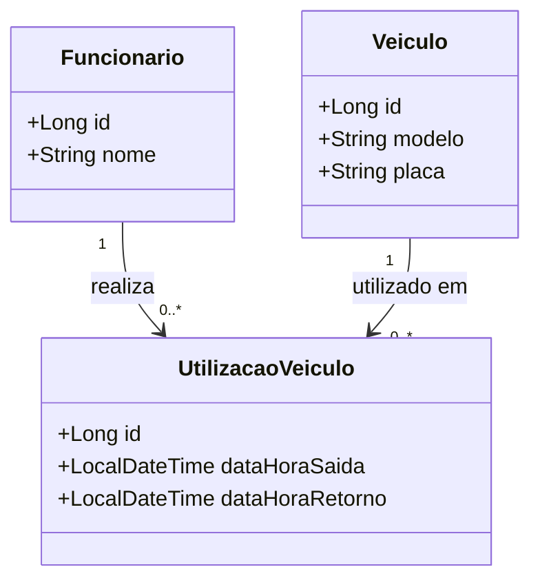

# Controle de Veículos

> Substitua o título acima pelo nome do seu sistema e preencha cada seção deste documento.
> Este README é o **documento de visão** do projeto (entrega **AVA 1**) e, ao longo do curso,
> também será o manual técnico de como executar o sistema.

| | |
|---|---|
| **Aluno(a)** | Vitor Emanuel de Lima Vodinciar |
| **Turma** | TEC-N-001788/2026 |
| **Opção escolhida** | Proposta própria |
| **Versão atual** | 0.1.0 |

---

## 1. Visão geral

### 1.1 atualmente não temos controle sobre quem está utilizando os veículos da empresa, nem informações precisas sobre quando e por quanto tempo eles foram utilizados. Essa falta de rastreabilidade dificulta a identificação de funcionários que permanecem por tempo excessivo em determinados trajetos, a identificação dos responsáveis por multas recebidas e por danos encontrados nos veículos, além de impedir um acompanhamento adequado do histórico de utilização da frota. Como consequência, a empresa perde eficiência na gestão dos veículos e fica mais exposta a custos
<!-- Que problema o sistema resolve? Quem sofre com esse problema hoje e como ele é resolvido (planilha, papel, WhatsApp...)? 3 a 5 linhas. -->

### 1.2 Canvas do projeto

| Bloco | Resposta |
|---|---|
| **Usuários** (quem usa o sistema) | Todos os funcionários que usam os veículos |
| **Problema** (dor atual) | Funcionários demorando tempo de mais em corridas, multas de trânsito sem identificação do infrator|
| **Proposta de valor** (o que melhora com o sistema) | Com as informações colhidas, será possível identificar e educar o funcionário de acordo com as necessidades |
| **Funcionalidades principais** | Identificação do funcionário, hora de início do trajeto e hora do final do trajeto |
| **Informações que o sistema guarda** | Nome do funcionário, horários, veículos |
| **Indicadores** (o que o gestor quer acompanhar) | Horários e datas que determinados veículos foram usados por determinados funcionários |
| **Restrições** (prazo, tecnologia, equipe) | Projeto individual · Java 21 · Spring Boot 4 · entrega v1.0 em 11/11 |

---

## 2. Requisitos

### 2.1 Requisitos funcionais (o que o sistema FAZ)

| ID | Requisito | Nível |
|---|---|---|
| RF01 | O sistema deve permitir cadastrar funcionários e veículos da empresa. | Essencial |
| RF02 | O sistema deve permitir registrar a utilização de um veículo, informando o funcionário responsável, a data e o horário de saída.| Essencial |
| RF03 | O sistema deve permitir registrar a data e o horário de retorno do veículo utilizado. | Essencial |
| RF04 | O sistema deve permitir consultar o histórico de utilização dos veículos, exibindo os funcionários responsáveis, as datas e os horários de saída e retorno. | Essencial |

### 2.2 Requisitos não funcionais (COMO o sistema deve ser)

| ID | Requisito |
|---|---|
| RNF01 | O sistema deve ser acessado pelo navegador (aplicação web). |
| RNF02 | O sistema deve exigir login e senha; |

### 2.3 Regras de negócio (as REGRAS do negócio que o sistema precisa respeitar)

| ID | Regra |
|---|---|
| RN01 | Todo registro de utilização deve estar vinculado a um funcionário e a um veículo cadastrados no sistema. |
| RN02 | O horário de retorno de um veículo não pode ser anterior ao horário de saída da mesma utilização. |

---

## 3. Histórias de usuário

HU01 — Cadastro de funcionários e veículos

Como administrador, quero cadastrar funcionários e veículos, para manter os dados necessários para o controle da frota.

Critério de aceite: O sistema deve permitir cadastrar funcionários e veículos.
Critério de aceite: O sistema deve permitir consultar os funcionários e veículos cadastrados.

HU02 — Registro de utilização

Como funcionário, quero registrar a utilização de um veículo, para que a empresa saiba quem está utilizando cada veículo.

Critério de aceite: O sistema deve permitir informar o funcionário, o veículo, a data e o horário de saída.
Critério de aceite: O sistema deve salvar o registro de utilização com as informações fornecidas.

HU03 — Consulta do histórico

Como administrador, quero consultar o histórico de utilização dos veículos, para identificar os funcionários responsáveis e verificar os períodos de utilização.

Critério de aceite: O sistema deve exibir o funcionário responsável, o veículo, a data e os horários de saída e retorno.
Critério de aceite: O sistema deve permitir consultar os registros de utilizações anteriores.

---


## 4. Modelo de dados



## 5. Como executar

### No GitHub Codespaces (recomendado)
1. No repositório, clique em **Code → Codespaces → Create codespace on main** (ou abra o Codespace existente).
2. Aguarde a preparação do ambiente.
3. No terminal, execute:
   ```bash
   mvn spring-boot:run
   ```
4. Quando aparecer o aviso da porta **8080**, clique em **Abrir no navegador**.

### No computador (ferramentas instaladas)
Requisitos: JDK 21 e uma IDE (IntelliJ IDEA ou VS Code com o *Extension Pack for Java*).
Abra o projeto na IDE e execute a classe `SistemaApplication`. Acesse `http://localhost:8080`.

### Acesso
| Usuário | Senha | Perfil |
|---|---|---|
| admin | admin123 | Administrador |
| operador | operador123 | Operador |

*(o login passa a ser exigido a partir do Encontro 7)*

---

## 6. Tecnologias
Java 21 · Spring Boot 4 · Spring MVC · Thymeleaf · Bootstrap 5 · Spring Data JPA · H2 (desenvolvimento) · MySQL (produção) · Spring Security · Git/GitHub

## 7. Uso de inteligência artificial
<!-- Registre aqui, de forma resumida, quando e como você usou ferramentas de IA de forma relevante no projeto. -->

## 8. Histórico de versões
| Versão | Data | Descrição |
|---|---|---|
| 0.1.0 | | Projeto inicial criado a partir do repositório modelo |
